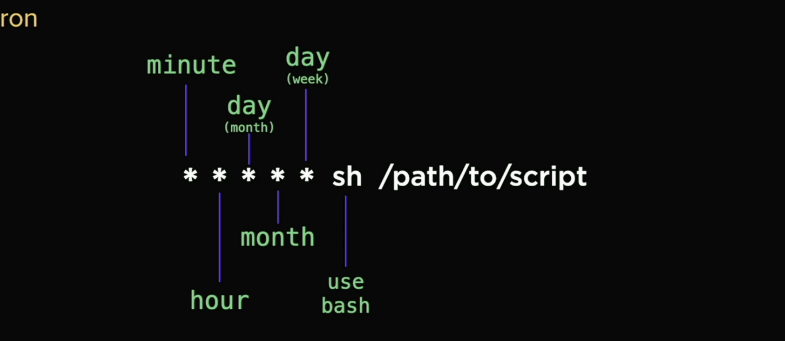

# Fullstack demo repo

## BE architecture course slides : https://alt-f4-llc.github.io/fem-bsda-presentation/slides.html

### Modern Computing

 - UI -> Server -> Database

### Terminal commands

- cat : shows file content
- man : command manual
- less: show file contents by page
- touch: creates an empty file (updates the last modified time if the file doesn't exists it creates the new file)
- echo: repeats the input
- cd ~ : redirects to home directory
- ls -la : l will show permission. a : shows the hidden files 
- cd / : root of your system
- rmdir: will not remove if there is something in the directory. use rm -rf.

### Vim
- i : insert mode.
- esc key : to get out of insert mode.
- U : undo the content in vim esc mode.
- :q! : save with out undo

### Shell
shell is the place where all your application is running
- zsh : mac shell
- bash : every unix base operating system.
- source "Shell config location" : if you modify your shell then use this command to load your shell configuraiton

### Server

- Needs to available everytime.
- CLOUD COMPUTING : 
	- virtualization : dividing the servers resources into virtual computers.

## Operating Systems

User -> Shell -> Kernel (talks to the hardware) -> hardware

## Security and Hashing

- Passoword cheat sheet : https://cheatsheetseries.owasp.org/cheatsheets/Password_Storage_Cheat_Sheet.html
- Hashing algorithms are one-way while encryption algorithms are two-way
- MD5 : Password + MD5 is a hash of different numbers
	- `openssl md5 foo`
	- md5 is very easily breakable
	- md5 hash is about 33 characters
- SHA1 hash is 44 character
	- `openssl sha1 foo`
- SHA256 is 65 characters
	- `openssl sha256 foo`
- We need SALT
	- we take any random number add it the password and we sha or sha256 to get a salted hash

## CLI command to start a server :  
	- `ssh -i ~/.ssh/newfsfe root@143.110.190.94` : ssh -i <path to ssh file> root@<IP address of the server>

## Internet (Networking)

- ping google.com : check the network host. Really fast way to tell where network is up or down
- traceroute google.com : All the hops from my computer to the destination host. prints every single hops
- netstat : tells all the things happening on the computer, all the running ports etc related to networking.

- TCP : transmission control protocol
	- TCP has handshake
	- extremely reliable
- UDP : User datagram Protocol
	- one way
	- good for sending real-time stuff : Streaming videos (UDP is really fast here)
	- example blurry video (some loss of packets over this protocol is not a problem)
- ICMP : Internet control message protocol
- Packet : a packet is a small unit of data transmitted over network

## DNS

- Computer talks to the browser and browser talks to DNS (Domain Name System) looks in the nameserver to return the ip address of the server.
- cname : mapping to name to name
- nslookup <name>  : look for the nameserver
- dig <name> : lookup DNS record for the doamin
- one domain name can have mutliple ip address because they are hosted on the different servers.
- .com : tld - top level domain. actually own by companies 

## Domain

- Look for email forwarding with the domain name ???
- updating and restarting the server.
	- apt is the package manager for ubuntu and linux distribution.
	- shutdown now -r : shutdown the server and restart the server.
	- root : is the highest permission level on the operating system. Allows unstricted access to the OS.
	- sudo: super user do. default is never as root.
	- adduser <name> : to add a new user to server.
	- usermod -aG sudo <name> : modify the user i.e. add the user to the sudo Group.
	- su <name> :  to change to user.
	- chmod 644 ~/.ssh/authorized_keys: changing read and write permission of authorized key.
	- sudo vi /etc/ssh/sshd_config: change the root permission of your server. etc can only be access with sudo.
	- sudo service ssh restart: restart the ssh process.
	- to switch to root : sudo -i

## Webservers : Nginx (https://www.f5.com/go/product/welcome-to-nginx) and Apache(https://httpd.apache.org/)

- Nginx is written in C and really fast, Faster than node.
- Reverse proxy : When a request comes to your server we need web servers to handle that requests, to route that reqiest.
- Nginx : can route to 
	- application
	- database
	- another server
- install nginx: sudo apt install nginx
- start nginx server  : sudo service nginx start
- Checkout nginx config : /etc/nginx/sites-available/default 
- root /var/www/html : root directory nginx is serving.
-  curl https://deb.nodesource.com/setup_20.x | sudo -E bash -  : Link to newest node source
- sudo apt-get install nodejs : to install nodejs
- Change owner ship of the directory /var/wwww to the user : sudo chown -R $USER: $USER /var/www
- make an app directory in /var/www : mkdir app
- git init to make it a git repository
- creating a virtual server/fake server on top of our server at /etc/nginx/sites-enabled/fsfe 
- We can create infinite number of server
- pointing nginx to new server we created
- nginx -t to validate your niginx file

## PM2 : `https://pm2.keymetrics.io/`

- As we exit our shell its not gonna run anymore
- sudo npm i pm2 -g: to install pm2 globally
- pm2 start app.js --watch : to start the server
## setting up auto restart
	- pm2 save: will save our current process list
	- pm2 startup : copy the command and paste

## verify github  `ssh -Tv git@github.com`

## Security

- To check auth log : sudo cat /var/log/auth.log
- Ports : Communication endpoints that maps to the specific process or network service.
- well known port : less /etc/services
- ports allows us to have multiple services on one ip addresses.
- ports are opening to your computer. nmap <ip address of your server>
- Extra service information : nmap -sV <ip address of your server>

# Firewall

- A network security device that monitors incoming and outgoing network traffic and decides whether to allow or block request based on defined set of rules.
- ufw : uncomplicated firewall
- ufw allow ssh
- ufw deny :  deny will tell you the error
- ufw reject : reject will silently reject not telling u the error. system will never respond to the error. like in cases DDOS attacks
- `sudo ufw status` : check firewall status
- `sudo ufw allow ssh` : to allow ssh request
- `sudo ufw allow http` : to allow http request
- `sudo ufw enable` : to enable firewall
- `sudo ufw status` : to see the status of the firewall ports

# Permissions

- owner-group-everyoneelse
- read-write-execute : rwx
- read : 4 (Octal value ) base 8
- write : 2 
- execute : 1
- rwx : 7
- chmod cheat sheet : https://quickref.me/chmod

# unattended upgrades :

- sudo apt install unattended-upgrades : install unattended upgrades.
- sudo dpkg-reconfigure --priority=low unattended-upgrades : enable upgrades

# CI/CD

- Continous integration : code changes are validated and merged back to the main branch as often as possible.
- Continous delivery : change are automatically built and ready for production.
- Continous deployment: Builds are automatically deployed in prod environment.
- link : `https://www.atlassian.com/continuous-delivery/principles/continuous-integration-vs-delivery-vs-deployment`
- cron : executes the command on schedule.

`https://crontab.guru/`
- * * * * * sh /var/www/app/github.sh 2>&1 | logger -t github.sh : crontab -e script.

- sudo cat /var/log/syslog : to access your system logs (whatever is going on with your system)
- sudo tail -f /var/log/syslog : to follow your system logs 

## Logging

/var/log
syslog : system logs
auth.log : when people are try to login in the system
nginx/access.log : nginx connection logs

- cat : will log the entire log file
- tail : will output last part of the file
- less : output one page at a time
- head : output first of a file
- | : read from the stdout
-  > : write stdout to a file
- >> : append to the stdout file
- < : read from stdin

# find and grep

## find is  where
- find /var/log -type f -name "*.log" : to find the log files in /var/log/
- sudo !!  - to rerun the last command in the unix history as sudo
- !! run the last command in unix history 
- find / -type d -name log

## grep is looking inside the files

- ps aux | grep node : find the node process running

# nginx redirection and gzip

- Gzip is the compression algorithm the run on nginx.
- you cannot gzip the pictures. they are already compressed.
- MPEG: Motion picture expert group
- JPEG: Joint picture expert group

# Subdomains

- create a virtual server in /etc/nginx/sites-enabled
- enter the entry in nginx.conf
- restart nginx

slide link : `https://static.frontendmasters.com/assets/courses/2023-04-18-fullstack-v3/fullstack-v3-slides.pdf`

